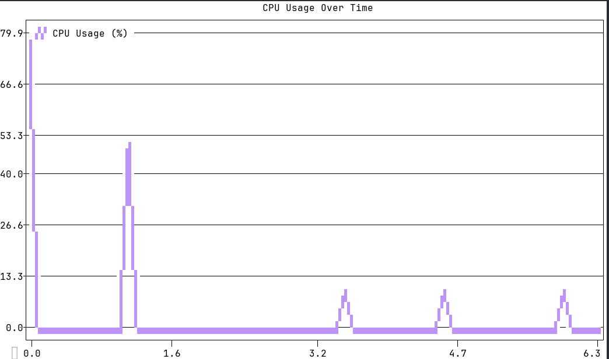
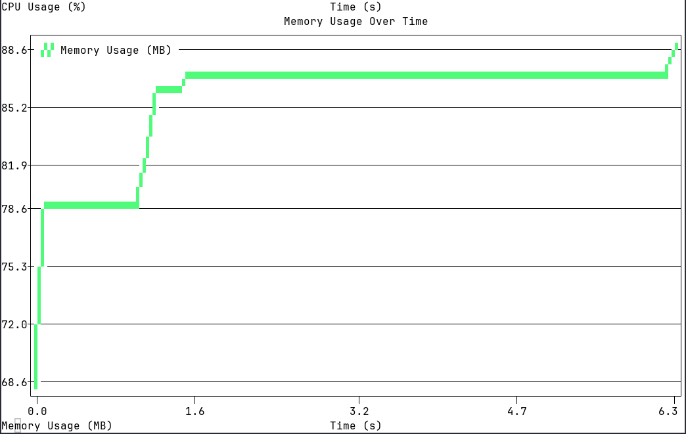

[](https://pypi.org/project/CommandTracker/) [](https://pypi.org/project/CommandTracker/)
 [](https://github.com/ErickCosta98/CommandTracker/releases) [](https://github.com/ErickCosta98/CommandTracker/blob/main/LICENSE)

# CommandTracker

CommandTracker is a Python tool designed to execute a command and monitor its resource usage in real time. It tracks CPU and memory consumption, providing valuable performance metrics like average CPU load and peak memory usage. This tool is ideal for developers and system administrators looking to optimize the performance of commands or processes.

## Features

- Monitor CPU and memory usage of any command.
- Real-time resource tracking during command execution.
- Provides performance statistics, including average CPU usage and peak memory consumption.
- Generation of graphs to visualize resource usage.  
- Historical logging of command execution.  

## Installation

You can install CommandTracker via pip:

```bash
pip install CommandTracker
```

## Usage

Once installed, you can use `ctracker` to monitor a command’s resource usage:

```bash
ctracker monitor <command>
```

For example:

```bash
ctracker monitor php artisan calc --date=2024-01-01
```
### Example Output:

```bash
Starting process with PID 12345...

Output of your command...

Process finished.
Total execution time: 10.25 seconds.

Resource usage statistics:
Average CPU usage: 35.67%
Maximum memory usage: 120.45 MB
```


Use -g or --graph to generate graphs.

```bash
ctracker monitor -g <command>
```
For example:

```bash
ctracker monitor -g php artisan calc --date=2024-01-01
```

### Example Output:

CPU usage graph:
  

Memory usage graph:
  


## History logs
Use `ctracker history` to see the all command history.

```bash
ctracker history
```

### Example Output:
  
```bash
  2024-10-02 09:12:30 python3 script.py --input=data.csv --output=result.txt Total execution time: 25.78 seconds. Average CPU usage: 3.12% Maximum memory usage: 75.34 MB
  2024-10-02 09:15:45 php74 artisan migrate --force Total execution time: 12.43 seconds. Average CPU usage: 1.58% Maximum memory usage: 65.12 MB
  2024-10-02 09:20:10 node server.js Total execution time: 50.92 seconds. Average CPU usage: 4.67% Maximum memory usage: 120.87 MB
  2024-10-02 09:25:00 bash backup.sh --full Total execution time: 105.34 seconds. Average CPU usage: 2.87% Maximum memory usage: 200.45 MB
  2024-10-02 09:30:40 ruby script.rb --optimize Total execution time: 30.22 seconds. Average CPU usage: 2.45% Maximum memory usage: 78.65 MB

```
For find command history:

```bash
ctracker history <command>
```

For example:

```bash
ctracker history python3 script.py --input=data.csv --output=result.txt
```

### Example Output:

```bash
  2024-10-02 09:12:30 python3 script.py --input=data.csv --output=result.txt Total execution time: 25.78 seconds. Average CPU usage: 3.12% Maximum memory usage: 75.34 MB
  2024-10-02 09:14:15 python3 script.py --input=data.csv --output=result.txt Total execution time: 30.21 seconds. Average CPU usage: 4.10% Maximum memory usage: 80.45 MB
  2024-10-02 09:16:05 python3 script.py --input=data.csv --output=result.txt Total execution time: 22.56 seconds. Average CPU usage: 2.98% Maximum memory usage: 72.15 MB
  2024-10-02 09:18:50 python3 script.py --input=data.csv --output=result.txt Total execution time: 28.90 seconds. Average CPU usage: 3.54% Maximum memory usage: 78.22 MB
  2024-10-02 09:21:33 python3 script.py --input=data.csv --output=result.txt Total execution time: 35.67 seconds. Average CPU usage: 4.75% Maximum memory usage: 82.90 MB
  2024-10-02 09:23:25 python3 script.py --input=data.csv --output=result.txt Total execution time: 18.45 seconds. Average CPU usage: 2.65% Maximum memory usage: 68.12 MB
  2024-10-02 09:25:12 python3 script.py --input=data.csv --output=result.txt Total execution time: 29.88 seconds. Average CPU usage: 3.87% Maximum memory usage: 77.56 MB
```


## Requirements

- Python 3.6+
- psutil library

## Contributing

Feel free to contribute by submitting issues or pull requests. More features and optimizations will be added in future versions.

## License

This project is licensed under the MIT License. See the [LICENSE](LICENSE) file for details.

## Future Enhancements

Planned features for future releases include:

• Automatic alerts if a process exceeds certain CPU or memory thresholds.
• Stress testing to simulate intensive workloads.


